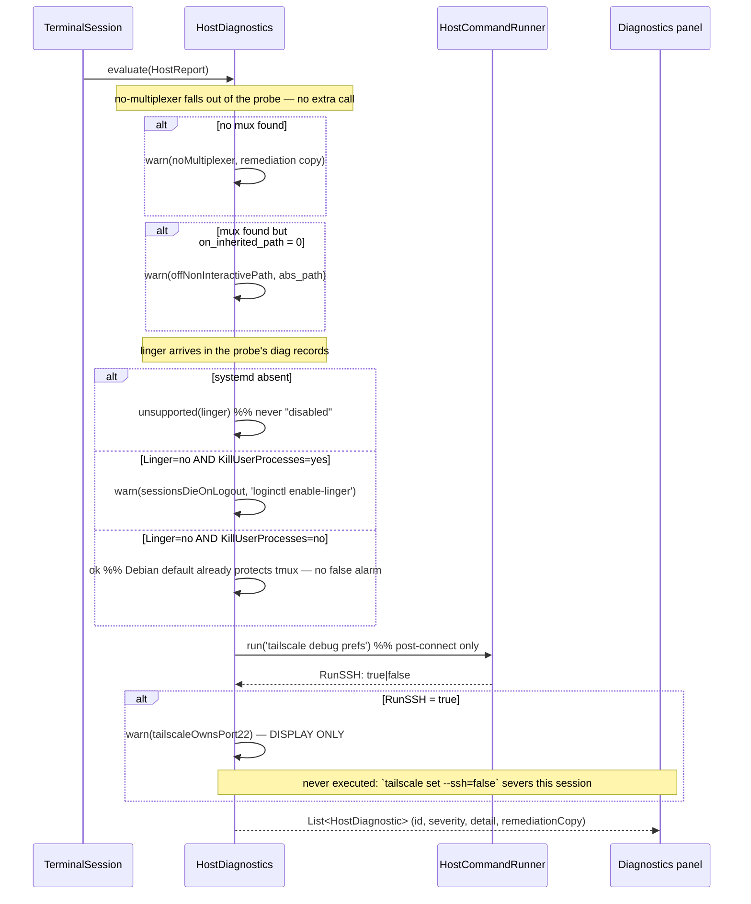

# Design: Host Session Contract

## Technical Approach

Ports & adapters around one seam. `HostCommandRunner` is the only thing that knows about
transport; `MultiplexerAdapter` is the only thing that knows about a specific multiplexer;
`docs/host-contract/v1.md` is the only thing consumer #2 needs. Everything above them
consumes a parsed `HostReport` and never a raw command string.

Two rules make the abstraction honest rather than lowest-common-denominator:

1. Only five operations are uniform (`detect`, `listSessions`, `hasSession`,
   `attachCommand`, install/version state). They are the whole base interface.
2. Everything else is an **advertised capability**. Agent state is herdr-only and is
   reachable through a nullable sub-interface, so the compiler — not a convention —
   forces the caller to handle "this host cannot answer that".

New code lands in `lib/core/host/`, outside any feature folder, because three features
(`terminal`, `shortcuts`, `connection`) consume it.

---

## Wire Contract v1

Language-neutral. A TypeScript reader needs `docs/host-contract/v1.md` and nothing else.

### Grammar

```
line 1        : "helm-probe/1" LF                 -- exact bytes, no fields
line 2..n-1   : <kind> TAB <field> [TAB <field>]* LF
last line     : "end" TAB <status> TAB <elapsed_ms> LF
```

Framing is TAB-delimited, LF-terminated. Every **value** is escaped by the probe before
emission; delimiters never are:

| Raw byte | Emitted as |
|---|---|
| `\` | `\\` |
| TAB | `\t` |
| LF | `\n` |
| CR | `\r` |

That is the complete escape table — four rules, one `sed` expression, decodable in five
lines in any language. This is why the contract is a delimited stream and not JSON: a
POSIX-`sh` JSON escaper must also handle `"` and `\uXXXX` control-code forms, is easy to
get subtly wrong, and one bad byte corrupts the *whole document*. Here a bad byte corrupts
*one record*, and every other record still parses.

### Record kinds (v1)

| kind | fields |
|---|---|
| `env` | `key`, `value` — `path_inherited`, `path_repaired`, `uname`, `shell`, `user`, `home` |
| `mux` | `id`, `found` (`0\|1`), `abs_path`, `version`, `on_inherited_path` (`0\|1`) |
| `session` | `mux_id`, `name`, `state` (`active\|exited\|unknown`), `attached` (`0\|1\|unknown`) |
| `agent` | `mux_id`, `session`, `target`, `label`, `state` (`idle\|working\|blocked\|done\|unknown`) |
| `diag` | `id`, `status` (`ok\|warn\|unsupported\|unknown`), `detail` |
| `err` | `scope`, `detail` — a bounded partial failure that did **not** abort the probe |
| `end` | `status` (`ok\|partial`), `elapsed_ms` |

`mux` is emitted for **all three** multiplexers on every probe (locked decision 5), so the
client can offer switching and can say *"herdr is at `/opt/homebrew/bin/herdr` but is off
your non-interactive PATH"* — the difference between `found=1, on_inherited_path=0` and
`found=0`. That distinction is the whole point of `path_inherited` vs `path_repaired`.

### Evolution rules (normative, in the doc)

| Rule | Reader behavior |
|---|---|
| Unknown `kind` | **Skip the record.** Never fail. |
| Extra trailing fields on a known kind | **Ignore them.** Fields are append-only. |
| Missing `end` record | Treat the report as **truncated**, not as "no sessions". |
| First line is `helm-probe/2` | **Refuse and report a version mismatch.** Never guess. |

Fields are never reordered or removed inside a major version. Truncation detection is why
`end` exists: without it a dropped connection is indistinguishable from an empty host.

---

## Architecture Decisions

### AD-1 — Probe travels as stdin to `sh -s`, never as the exec command string

| Option | Tradeoff | Decision |
|---|---|---|
| Script **as** the exec command string | sshd runs it as `$SHELL -c '<script>'` using the **user's login shell**. A fish/csh/nushell login shell cannot parse a POSIX script. The script also passes through that shell's quoting layer. | Rejected |
| `execute('/bin/sh -s')`, script written to stdin, stdin closed | The exec string is a fixed two-token literal every login shell can run. Script bytes traverse **zero** quoting layers, so the script's own content has no escaping or injection surface. | **Chosen** |
| Install a versioned script on the host | Faster and cacheable, but violates locked decision 4 (zero host footprint). | Rejected |

Verified: `SSHSession.stdin` is documented in dartssh2 2.16.0 as *"Close this to send EOF
to the remote process"*, which is exactly what `sh -s` requires.

**The probe MUST NOT request a PTY.** With a PTY, stdin and stdout are the same tty, the
tty echoes the script back into stdout and corrupts the record stream. Probe = exec, no
pty. Attach = exec, **with** pty. Different calls, different configuration.

### AD-2 — Capability is a nullable sub-interface, not a flag plus a throwing method

| Option | Tradeoff | Decision |
|---|---|---|
| `listAgents()` on the base interface | Throws `UnimplementedError` on 2 of 3 implementations. Dishonest interface. | Rejected |
| `supports(cap)` guard + method on base | Advisory only — a caller can skip the guard and compile fine. | Rejected as the *sole* mechanism |
| `AgentAwareMultiplexer? get agents` (null ⇒ unsupported) | The **type system** forces the null check; you cannot reach `listAgents()` without proving support. | **Chosen** |

Both survive, for different jobs: `capabilities` (a `Set`) is for **reporting** — rendering
"this host cannot tell you when an agent blocks". The nullable accessor is for
**execution**. A caller that needs agent state and gets `null` returns a typed
`AgentSupport.unsupported(muxId)`; it never throws and never silently returns an empty list
that reads as "no agents are working".

### AD-3 — `attachCommand` single-quotes the session name

Session names are user-controlled and reach a remote shell. Today
`TmuxService.createSession` interpolates into **double** quotes, which does not stop
`$(...)` or backticks — this change closes an existing hole rather than opening a new one.
`attachCommand` is a **pure function** (no I/O), so the quoting is unit-testable without
SSH, and it uses the absolute path the probe resolved, not a bare binary name.

### AD-4 — PTY denial gets a branch *before* the generic `SSHError` branch

Verified from source: `SSHChannelRequestError implements SSHError`, so it is **already**
caught by `describeError`'s `if (error is SSHError)` and rendered as the useless
`SSH error: SSHChannelRequestError(Failed to start pty)`. It is not unclassified — it is
*mis*classified. dartssh2 gives no error code, so `message == 'Failed to start pty'` is the
only discriminator; the string is pinned by `pubspec.lock` and asserted by a test constant.

### AD-5 — Migration adds two fields and writes both key sets

New: `sessionRef` (String?, the neutral name) and `multiplexer` (String?, null ⇒ host
default). Reading normalizes `tmuxSession → sessionRef` before the generated
`_$XFromJson`; writing emits **both** old and new keys for the compat window. Emitting both
is what makes slice 6 revertable: a reverted build still finds `tmuxSession` in data
written by the new build. `json_serializable` cannot express a read-alias or a duplicate
write key, so `fromJson`/`toJson` get thin hand-written wrappers around the generated pair.

### AD-6 — `lib/core/host/`, not a package

Locked decision 1: consumer #2 is Next.js/TypeScript, so the reusable artifact is
`docs/host-contract/v1.md`, not Dart. Extracting a Dart package would serve nobody.

---

## Sequence Diagrams

### Connect → preflight probe → session picker

```mermaid
sequenceDiagram
    participant UI as TabsProvider
    participant TS as TerminalSession
    participant R as SshHostCommandRunner
    participant C as SSHClient (dartssh2)
    participant H as Remote host

    UI->>TS: connect(profile, key)
    TS->>C: SSHSocket.connect + auth (TOFU host key)
    TS->>R: runScript(probeScriptV1)
    R->>C: execute('/bin/sh -s')   %% no pty
    C->>H: exec channel
    R->>C: stdin.add(script); stdin.close()
    H-->>C: helm-probe/1 record stream
    C-->>R: stdout + exitCode
    R-->>TS: HostCommandResult
    TS->>TS: HostProbeParser.parse → HostReport

    alt end record missing
        TS-->>UI: HostReport.truncated  %% never "no sessions"
    else version != 1
        TS-->>UI: HostReport.versionMismatch
    else ok
        TS-->>UI: sessions + mux install/PATH state
        UI->>UI: session picker (offer switching multiplexer)
    end

    UI->>TS: attach(sessionRef)
    TS->>C: execute(adapter.attachCommand(ref), pty: SSHPtyConfig(...))
    Note over C: dartssh2 sends pty-req BEFORE exec — no shell, no prompt, no race
    alt pty denied
        C--xTS: SSHChannelRequestError('Failed to start pty')
        TS-->>UI: describeError → actionable PTY-denied copy
    else
        C-->>TS: SSHSession
        TS->>TS: _bridgeIO(session)   %% unchanged: same type as shell()
    end
```

### Diagnostics evaluation → user-facing report



---

## Interfaces / Contracts

```dart
// lib/core/host/host_command_runner.dart
abstract interface class HostCommandRunner {
  /// One-shot command. Runs through the user's login shell (sshd semantics).
  Future<HostCommandResult> run(String command, {Duration? timeout});

  /// Feeds [script] to `/bin/sh -s` over stdin. Script bytes traverse no
  /// quoting layer and no PTY is requested. See AD-1.
  Future<HostCommandResult> runScript(String script, {Duration? timeout});
}

class HostCommandResult {
  final String stdout, stderr;
  final int? exitCode;   // nullable: dartssh2 may not receive an exit-status
  final bool timedOut;
}
```

```dart
// lib/core/host/multiplexer_adapter.dart
enum MultiplexerId { herdr, tmux, zellij }

enum MuxCapability {
  agentState, agentWait, structuredOutput,
  sessionWorkingDirectory, deadSessionResurrection,
}

abstract interface class MultiplexerAdapter {
  MultiplexerId get id;

  /// Advertised for REPORTING ("this host cannot tell you when an agent blocks").
  Set<MuxCapability> get capabilities;

  /// Non-null only when [MuxCapability.agentState] is advertised.
  /// Nullability is the EXECUTION guard — see AD-2.
  AgentAwareMultiplexer? get agents;

  Future<MuxDetection> detect();            // installed? absPath, version
  Future<List<MuxSession>> listSessions();
  Future<bool> hasSession(String name);
  String attachCommand(String sessionName); // pure, quoted, absolute path
}

abstract interface class AgentAwareMultiplexer {
  Future<List<AgentStatus>> listAgents();
  Future<AgentStatus?> waitForAgent(
    String target, {
    required Set<AgentState> until,
    Duration? timeout,
  });
}
```

| Adapter | `capabilities` | `agents` | Session source |
|---|---|---|---|
| `HerdrAdapter` | `agentState`, `agentWait`, `structuredOutput` | non-null | `herdr session list --json` |
| `TmuxAdapter` | `sessionWorkingDirectory` | **null** | `tmux list-sessions -F '#{session_name}' 2>/dev/null \|\| true` |
| `ZellijAdapter` | `deadSessionResurrection` | **null** | `zellij list-sessions --no-formatting --short` |

Caller negotiation:

```dart
final agents = adapter.agents;
if (agents == null) return AgentSupport.unsupported(adapter.id); // typed, never throws
final blocked = await agents.waitForAgent(target, until: {AgentState.blocked});
```

Degraded-state handling that must not be mistaken for "empty": tmux with no server writes
to **stderr** and exits non-zero; herdr's CLI talks to a local socket and fails when no
server runs; zellij lists `(EXITED - attach to resurrect)`. Each maps to an explicit
`MuxDetection.serverNotRunning` or `MuxSession.state = exited` — never to `[]`.

---

## File Changes

| File | Action | Description |
|---|---|---|
| `docs/host-contract/v1.md` | Create | The reusable artifact. Grammar, kinds, escape table, evolution rules |
| `lib/core/host/host_command_runner.dart` | Create | Port + `HostCommandResult` |
| `lib/core/host/ssh_host_command_runner.dart` | Create | dartssh2 adapter (`run`, `runScript` via `sh -s`) |
| `lib/core/host/shell_quote.dart` | Create | POSIX single-quote escaping (`'\''` idiom) |
| `lib/core/host/probe/probe_script_v1.dart` | Create | The POSIX `sh` script as a Dart string constant |
| `lib/core/host/probe/host_probe_parser.dart` | Create | Record-stream decoder + unescaper |
| `lib/core/host/probe/host_report.dart` | Create | freezed model: env, mux, sessions, agents, diagnostics |
| `lib/core/host/multiplexer_adapter.dart` | Create | Interface, capabilities, `AgentAwareMultiplexer` |
| `lib/core/host/adapters/{tmux,zellij,herdr}_adapter.dart` | Create | Three implementations |
| `lib/core/host/host_diagnostics.dart` | Create | Linger/`KillUserProcesses`/Tailscale evaluation |
| `lib/features/shortcuts/data/remote_fs_service.dart` | Modify | Takes `HostCommandRunner`; drops `tmux display-message` |
| `lib/features/terminal/data/terminal_session.dart` | Modify | Attach via `execute(pty:)`; delete the stdin write at 67-70 |
| `lib/features/connection/data/ssh_service.dart` | Modify | PTY-denied branch **before** the `SSHError` branch |
| `lib/features/connection/domain/connection_profile.dart` | Modify | `sessionRef` + `multiplexer`; compat `fromJson`/`toJson` |
| `lib/features/shortcuts/domain/project_shortcut.dart` | Modify | Same migration |
| `lib/features/terminal/data/session_snapshot_repository.dart` | Modify | `TabSnapshot.sessionRef` + compat reader (hand-written JSON, no codegen) |
| `lib/core/constants/app_constants.dart` | Modify | `defaultTmuxSession` → `defaultSessionRef` (value `'helm'` unchanged) |
| `profile_edit_screen.dart`, `shortcut_form_sheet.dart`, `tabs_provider.dart` | Modify | Field rename + multiplexer selection |
| `lib/features/terminal/domain/services/tmux_service.dart` | Delete | Superseded by `TmuxAdapter` (slice 3) |
| `test/helpers/fake_host_command_runner.dart` | Create | Scripted stdout/exit per command; the fake every adapter test uses |

---

## Testing Strategy

`tdd: true`, `flutter test`, hand-written fakes only (no mocktail).

| Component | Layer | What / How |
|---|---|---|
| `HostProbeParser` | Unit | Golden fixtures: happy, unknown kind, extra fields, missing `end`, `helm-probe/2`, values containing TAB/LF/`\`. Pure — no SSH |
| `shellQuote` | Unit | `x; rm -rf ~`, `$(id)`, backticks, embedded `'`. Property-ish table |
| `attachCommand` | Unit | Pure function per adapter; asserts absolute path + quoting |
| Adapters | Unit | `FakeHostCommandRunner` returns canned CLI output: tmux "no server running" on stderr + non-zero; zellij ANSI + `EXITED`; herdr socket-down |
| Capability model | Unit | `TmuxAdapter.agents == null`; `HerdrAdapter.agents != null`; unsupported path returns typed value and **does not throw** |
| `SshHostCommandRunner` | Unit | Fake `SSHClient` seam: asserts `runScript` uses `'/bin/sh -s'`, **no pty**, and closes stdin |
| `describeError` | Unit | Extends the existing `ssh_service_test.dart`; asserts PTY-denied resolves before the generic `SSHError` branch |
| `TerminalSession` | **Characterization first** | Zero coverage today. Slice 5 lands connect/disconnect/reconnect/resize/`_bridgeIO` characterization tests **before** touching attach, then the attach test |
| Migration | Unit | Round-trip old-only JSON, new-only JSON, both-keys JSON; assert `toJson` emits both keys |
| `HostDiagnostics` | Unit | Truth table: systemd absent ⇒ `unsupported`; `Linger=no` + `KillUserProcesses=no` ⇒ `ok` (no false alarm); `RunSSH=true` ⇒ warn, **never executed** |

No E2E: a real host is out of CI reach. The record-stream fixtures are the substitute and
double as the conformance suite a TypeScript reader can reuse.

---

## Threat Matrix

Applicable — this change composes shell commands and executes them on a remote host.

| Boundary | Adversarial cases | Applicability | Design response | Planned RED tests |
|---|---|---|---|---|
| Documentation-like paths | `README.sh`, executable Markdown | **N/A** — no file classification or execution-by-extension exists anywhere in this change | — | None |
| Git repository selection | `git -C`, relative/absolute paths | **N/A** — no VCS automation in scope | — | None |
| Commit state | staged, `commit -a`, empty index | **N/A** — no VCS automation | — | None |
| Push state | tracking branch, first push | **N/A** — no VCS automation | — | None |
| PR commands | `--head`, env prefix, composed commands | **N/A** — no PR automation | — | None |
| **Shell argument composition** (added) | Session name `x; rm -rf ~`, `$(id)`, `` `id` ``, embedded `'`, leading `-` | **Applicable** — `attachCommand` interpolates a user-controlled name into a string parsed by the remote login shell | POSIX single-quote wrap via `shellQuote` (`'\''` idiom) + conservative charset validation at the persistence boundary. Safe: name is passed as one literal argument. Failure: rejected at save time with a typed error | One test per metacharacter class on `shellQuote`; one per adapter on `attachCommand` |
| **Probe delivery** (added) | Login shell is fish/csh; restricted shell; `/bin/sh` missing | **Applicable** — script crosses a shell boundary | Fixed literal exec string `'/bin/sh -s'`; script bytes go over stdin and cross zero quoting layers (AD-1). Failure: non-zero exit ⇒ `probe_unavailable` diagnostic, **never** a silent tmux-only fallback | Assert exec string is the literal and no pty; assert non-zero exit surfaces `probe_unavailable` |
| **Untrusted host output** (added) | Session name containing TAB/LF/`\`; ANSI escapes from zellij; truncated stream | **Applicable** — host output is parsed and rendered into a terminal | Escape table decoded by the parser; ANSI stripped before display; missing `end` ⇒ `truncated`, never "no sessions" | Parser fixtures for each byte class; truncation fixture |
| **Unbounded host traversal** (added) | `find` over a network mount hangs the probe on a mobile link | **Applicable** | Every traversal bounded, matching `detectProjects`' existing `-maxdepth 3 \| head -50`; `runScript` takes a `timeout` and reports `timedOut` | Timeout test asserting `timedOut` and no partial-report acceptance |

---

## Slice Mapping

| # | Slice | New/Modified | Compiles + `flutter test` green alone |
|---|---|---|---|
| 1 | Port + dartssh2 adapter + fake; adopt in `RemoteFsService` | `host_command_runner`, `ssh_host_command_runner`, fake | Yes — pure seam, no behavior change. First tests for an untested service |
| 2 | Probe script + parser + `HostReport` + `docs/host-contract/v1.md` | `probe/*`, `shell_quote` | Yes — additive; nothing consumes it yet |
| 3 | `MultiplexerAdapter` + capabilities + Tmux + Zellij | `multiplexer_adapter`, 2 adapters | Yes — `TmuxService` still exists; split Zellij to 3b if over 400 |
| 4 | `HerdrAdapter` + agent-state capability | `herdr_adapter` | Yes — additive |
| 5 | Exec-with-PTY attach + PTY-denied + `TerminalSession` tests | `terminal_session`, `ssh_service` | Yes — **characterization tests land first inside this slice** |
| 6 | Persisted-model migration | 3 models + 3 UI files | Yes — compat reader + dual-key writer make it revertable |
| 7 | Diagnostics | `host_diagnostics` | Yes — display-only |

`TmuxService` is deleted in slice 3, after `TmuxAdapter` replaces it, so no slice ever
leaves a dangling reference.

---

## Migration / Rollout

Additive fields, dual-key writes, no destructive step. `sessionRef` and `multiplexer` are
both nullable/defaulted, so data written by the current build reads unchanged. The legacy
`tmuxSession` key is **not** removed in this change (locked decision 6); its removal is a
separate change after one release. Rollback per the proposal's per-slice plan.

---

## Open Questions

Recorded, not guessed. None blocks slices 1–3.

- [ ] **`herdr agent list` output format is [UNVERIFIED].** The CLI reference documents
      `session list [--json]` with an explicit flag but `agent list` **without** one, while
      stating "most commands print JSON responses". Blocks slice 4's parser. Resolve by
      running `herdr agent list` and `herdr api schema --json` on a real host.
- [ ] **herdr agent state domain.** Docs show `idle|working|blocked|unknown` for
      `pane report-agent` but `idle|working|blocked|done|unknown` for `report-metadata`
      state labels. The wire contract currently allows all five. Confirm whether `done` is
      reachable from `agent list`.
- [ ] **herdr session enumeration with no server running.** The CLI talks to a local
      socket; the failure mode when no server is up is unverified. Must map to
      `serverNotRunning`, not to an empty list. Blocks slice 4.
- [ ] **`sessionRef` shape.** Plain `String` name (chosen, minimal migration risk) versus a
      structured `{muxId, name}`. If a user runs the same session name under two
      multiplexers, the plain string is ambiguous. Accepted for v1; revisit if it bites.
- [ ] Probe cost budget on a mobile link is unmeasured — enumerating all three multiplexers
      (locked decision 5) is the right behavior but the timeout value is a guess until
      measured on a real device.
